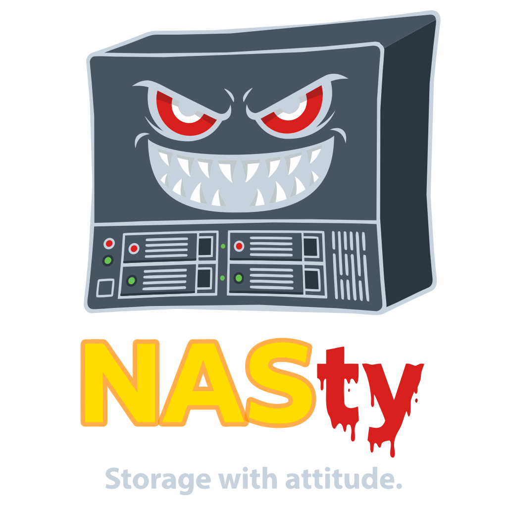

  

---

## What is NASty?

NASty is a self-contained NAS operating system that turns commodity hardware into a full-featured storage appliance.

- **Storage pools** with compression, checksumming, and tiering
- **Subvolumes** with O(1) snapshots and COW cloning
- **File sharing** via NFS, SMB, iSCSI, and NVMe-oF
- **Web UI** for managing everything from a browser
- **Web terminal** with built-in shell access
- **Atomic updates** with one-click rollback
- **Kubernetes integration** via a CSI driver for dynamic volume provisioning

## Getting Started

Download the latest ISO from [Releases](../../releases) and boot it on your hardware. The installer will guide you through disk selection and initial setup.

Pre-built QCOW2 cloud images (x86_64 and aarch64) are also available in Releases for VM-based testing.

Default credentials: `admin` / `admin`.

## Kubernetes CSI Driver

NASty includes a CSI driver for dynamic volume provisioning in Kubernetes clusters:

- [nasty-csi](https://github.com/nasty-project/nasty-csi) -- CSI driver
- [nasty-chart](https://github.com/nasty-project/nasty-chart) -- Helm chart
- [nasty-go](https://github.com/nasty-project/nasty-go) -- Go client library
- [nasty-plugin](https://github.com/nasty-project/nasty-plugin) -- kubectl plugin

## Protocols

| Protocol | Use Case |
|----------|----------|
| **NFS** | Linux/Unix file sharing, Kubernetes ReadWriteMany |
| **SMB** | Windows/macOS file sharing |
| **iSCSI** | Block storage for VMs and databases |
| **NVMe-oF** | High-performance block storage over TCP |

## License

GPLv3
