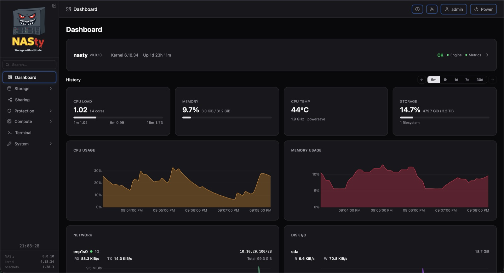
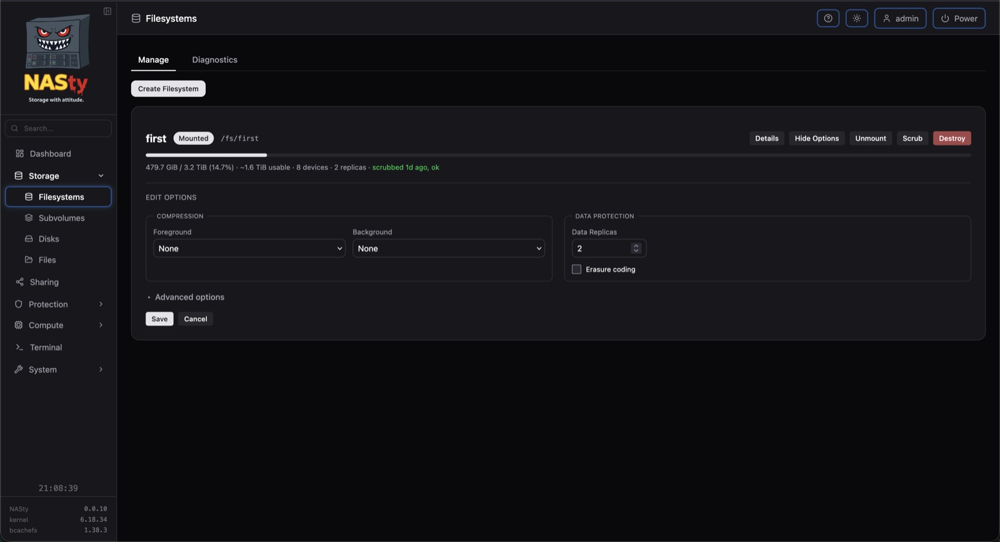
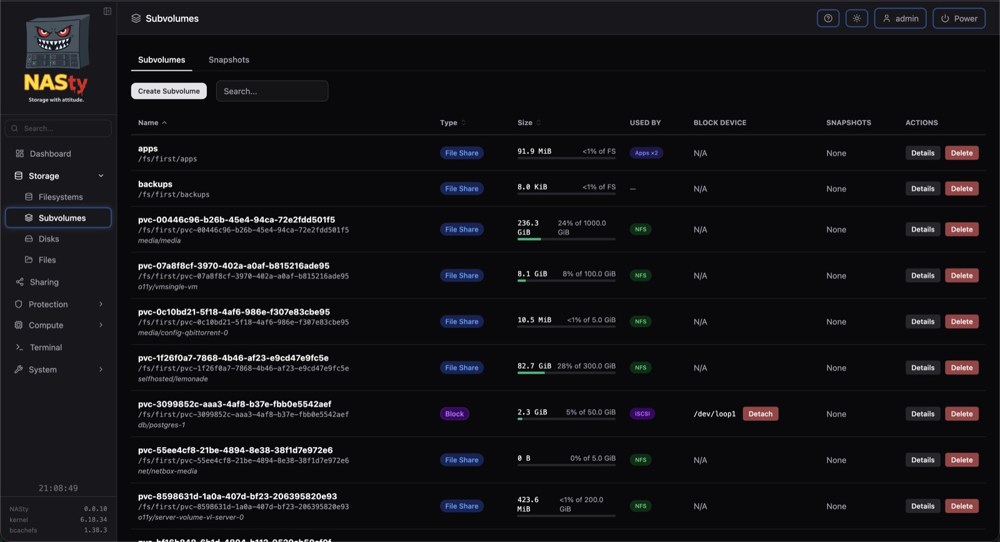
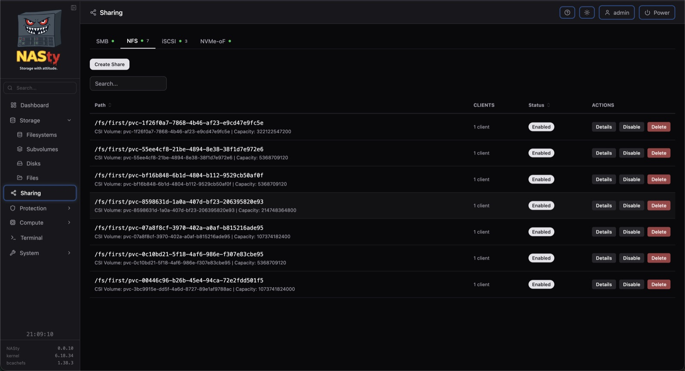
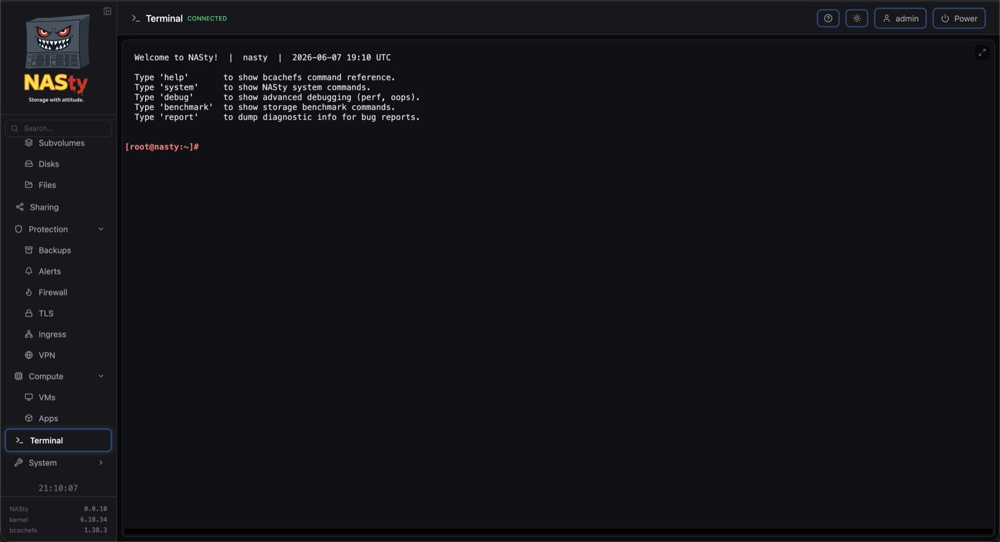

<p align="center">
  <picture>
    <source media="(prefers-color-scheme: dark)" srcset="webui/src/lib/assets/nasty-white.svg" />
    <source media="(prefers-color-scheme: light)" srcset="webui/src/lib/assets/nasty.svg" />
    
  </picture>
</p>

<p align="center">
  <strong>A NAS appliance built on bcachefs.</strong>
</p>

---

NASty is a NAS operating system built on NixOS and bcachefs. It turns commodity hardware into a storage appliance serving NFS, SMB, iSCSI, and NVMe-oF — managed from a single web UI, updated atomically, and rolled back when things go sideways.

## Features

### Storage
- **bcachefs** — compression, checksumming, erasure coding, tiering, encryption, O(1) snapshots
- **File sharing** — NFS and SMB with per-share ACLs
- **Block storage** — iSCSI and NVMe-oF with dedicated targets per volume
- **Subvolumes** — filesystem and block subvolumes with quotas, compression, and tiering per subvolume
- **Snapshots** — instant, space-efficient point-in-time copies
- **File browser** — browse, upload, and manage files from the web UI

### Monitoring & Alerts
- **Dashboard** — CPU, memory, storage, temperature, frequency — with scrollable history charts (30-day retention)
- **Alerts** — configurable rules for filesystem usage, disk health, temperatures, scrub errors, and more
- **Notifications** — alert delivery via SMTP email, Telegram, webhooks, and ntfy push notifications
- **S.M.A.R.T.** — disk health monitoring with per-disk details
- **[nasty-top](https://github.com/nasty-project/nasty-top)** — standalone TUI for live per-device IO, latency, and tuning

### Apps & VMs
- **Apps** — Docker containers and Compose stacks with auto-enable, image pull progress, and container inspect
- **Virtual machines** — QEMU/KVM with VNC console, disk snapshots, and VM cloning (experimental)

### System
- **Web UI** — manage filesystems, subvolumes, snapshots, shares, disks, services, and more
- **Web terminal** — built-in shell with command cheatsheets and diagnostic tools
- **Glossary** — built-in help page with storage terms, protocol guidance, and FAQ
- **Let's Encrypt** — automatic TLS certificates via ACME (TLS-ALPN and DNS challenges)
- **Tailscale** — built-in VPN with one-click setup
- **Access control** — local user accounts with role-based permissions and API tokens
- **UPS monitoring** — NUT integration for graceful shutdown on power loss (opt-in)
- **Atomic updates** — NixOS-based, with one-click rollback to any previous generation
- **Binary cache** — fast updates via cachix (bcachefs-tools, engine, webui pre-built)
- **Kubernetes integration** — CSI driver for dynamic volume provisioning across all 4 protocols

## Screenshots

<p align="center">
  
</p>
<p align="center"><em>Dashboard</em></p>

<p align="center">
  
</p>
<p align="center"><em>Filesystems</em></p>

<p align="center">
  
</p>
<p align="center"><em>Subvolumes</em></p>

<p align="center">
  
</p>
<p align="center"><em>Sharing</em></p>

<p align="center">
  
</p>
<p align="center"><em>Updates</em></p>

<p align="center">
  
</p>
<p align="center"><em>Terminal</em></p>

## Getting Started

1. Download the latest ISO from [Releases](../../releases)
2. Boot it on your hardware — the installer lets you pick a disk and press Enter
3. Open the WebUI at `https://<nasty-ip>`
4. Default credentials: **admin** / **admin**

ISO won't boot? Some UEFI firmware doesn't like NixOS ISOs. See [INSTALL.md](INSTALL.md) for an alternative installation method from any Linux live environment.

## Update Flavors

NASty has three update flavors:

| Flavor | What you get | Description |
|--------|-------------|-------------|
| **Mild** | Tagged stable releases (`v0.0.1`) | Stable releases |
| **Spicy** | Pre-release builds (`s0.0.1`) | Pre-release builds with newer features |
| **Nasty** | Latest commit on main | Bleeding edge, no guarantees |

Switch flavors from **Settings → Update → Flavor** in the WebUI.

## Architecture

| Component | Technology | Why |
|-----------|------------|-----|
| Engine | Rust | Async runtime, handles all storage and system operations |
| Web UI | SvelteKit + TypeScript | Reactive UI with real-time WebSocket updates |
| OS | NixOS | Atomic updates, rollback, reproducible system config |
| Filesystem | bcachefs | Checksumming, compression, tiering, snapshots, erasure coding |
| API | JSON-RPC 2.0 over WebSocket | Persistent connection, bidirectional, low overhead |

## Project Structure

```
engine/         Rust workspace — storage, sharing, system management
webui/          SvelteKit web interface
nixos/          NixOS modules and ISO configuration
```

The full ecosystem (CSI driver, Helm chart, kubectl plugin, and more) lives at [github.com/nasty-project](https://github.com/nasty-project).

## FAQ

See [FAQ.md](FAQ.md) for common questions about bcachefs, NixOS, and project status.

## Telemetry

NASty collects anonymous usage data (drive count and storage capacity). Disable anytime from **Settings → Telemetry**. Details: [nasty-telemetry](https://github.com/nasty-project/nasty-telemetry).

## License

GPLv3
