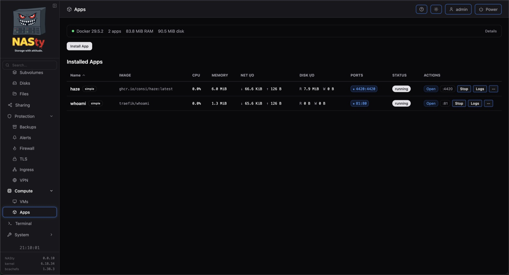
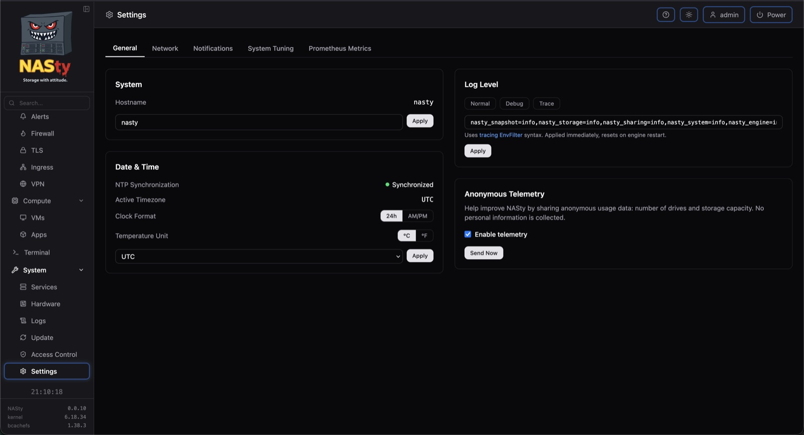

<p align="center">
  <picture>
    <source media="(prefers-color-scheme: dark)" srcset="webui/src/lib/assets/nasty-white.svg" />
    <source media="(prefers-color-scheme: light)" srcset="webui/src/lib/assets/nasty.svg" />
    
  </picture>
</p>

<p align="center">
  <strong>A NAS appliance built on bcachefs.</strong>
</p>

---

NASty is a NAS operating system built on NixOS and bcachefs. It turns commodity hardware into a storage appliance serving NFS, SMB, iSCSI, and NVMe-oF — managed from a single web UI, updated atomically, and rolled back when things go sideways.

## Star History

<a href="https://www.star-history.com/">
 <picture>
   <source media="(prefers-color-scheme: dark)" srcset="https://api.star-history.com/chart?repos=nasty-project/nasty&type=date&theme=dark&legend=top-left&sealed_token=j8EcY6L-xSWlQVDgIXXbwrqWyYn6QFx2CJHl3VCTqF0JfudPfxG0GZzd6ScaGSp04ca98RzbcTU5AmPvKdN34tWMo-Ok7N7QxUabUCs4kgIJCZ4OWlJK22PwzmFZdnKhtmcnjaL2RBfcg0x7K-4uWtcqQHMFqlwE0cH5qZaYdL1EDNMr5cxwa2PyDVOS" />
   <source media="(prefers-color-scheme: light)" srcset="https://api.star-history.com/chart?repos=nasty-project/nasty&type=date&legend=top-left&sealed_token=j8EcY6L-xSWlQVDgIXXbwrqWyYn6QFx2CJHl3VCTqF0JfudPfxG0GZzd6ScaGSp04ca98RzbcTU5AmPvKdN34tWMo-Ok7N7QxUabUCs4kgIJCZ4OWlJK22PwzmFZdnKhtmcnjaL2RBfcg0x7K-4uWtcqQHMFqlwE0cH5qZaYdL1EDNMr5cxwa2PyDVOS" />
   
 </picture>
</a>

## Features

### Storage
- **bcachefs** — compression, checksumming, erasure coding, tiering, encryption, O(1) snapshots
- **File sharing** — NFS and SMB with per-share ACLs
- **Block storage** — iSCSI and NVMe-oF with dedicated targets per volume, per-target portal management, and optional RDMA transports (iSER, NVMe-oF/RDMA, NFS-RDMA) for RoCE and InfiniBand NICs
- **Subvolumes** — filesystem and block subvolumes with quotas, compression, and tiering per subvolume
- **Snapshots** — instant, space-efficient point-in-time copies
- **Encryption lifecycle** — lock and unlock encrypted filesystems from the WebUI, with a dependents preview that lists every app, VM, share, and backup that would break before you confirm. Optional **TPM2-sealed keys** auto-unlock on boot when the measured-boot state matches
- **File browser** — browse, upload, edit, rename, copy, move, and bulk-manage files from the web UI
- **Backups** — encrypted, deduplicated, incremental backups to local, S3, SFTP, REST, or Backblaze B2 with per-profile schedules and retention — plus whole-snapshot restore, including disaster recovery onto a fresh box from an existing repository

### Monitoring & Alerts
- **Dashboard** — CPU, memory, storage, temperature, frequency — with scrollable history charts (30-day retention)
- **Alerts** — configurable rules for filesystem usage, disk health, temperatures, scrub errors, and more
- **Notifications** — alert delivery via SMTP email, Telegram, webhooks, and ntfy push notifications
- **S.M.A.R.T.** — disk health monitoring with per-disk details
- **[nasty-top](https://github.com/nasty-project/nasty-top)** — standalone TUI for live per-device IO, latency, and tuning

### Apps & VMs
- **Apps** — Docker containers and Compose stacks with image pull progress, container inspect, live per-app resource usage (CPU %, memory, network and disk I/O), and custom `.env` files for compose stacks, and an `allow_unsafe` escape hatch for stacks that need privileged options
- **Virtual machines** — QEMU/KVM with VNC console, disk snapshots, USB passthrough (editable on existing VMs), bridge selection, and an inline disk-import wizard for qcow2, raw, img, vdi, and vmdk images (optionally .xz/.gz/.bz2 compressed)
- **Hardware passthrough** — IOMMU group view, USB device inventory, vfio-pci toggles that survive reboots, and SR-IOV virtual-function management (per-VF VLAN, MAC, trust, spoof-check)
- **Network bridges** — Linux bridges for attaching VMs (and apps) to L2 networks alongside the host

### System
- **Web UI** — manage filesystems, subvolumes, snapshots, shares, disks, services, and more
- **Web terminal** — built-in shell with command cheatsheets and diagnostic tools
- **Custom NixOS config** — advanced users can drop settings the WebUI doesn't expose into `/etc/nixos/custom.nix`; NASty never overwrites it, so they persist across reboots and upgrades
- **Glossary** — built-in help page with storage terms, protocol guidance, and FAQ
- **Networking** — NetworkManager-based with confirm-or-rollback: edits stage, apply, and auto-revert if you don't confirm in time, so a typo can't lock you out over SSH
- **Let's Encrypt** — automatic TLS certificates via ACME (TLS-ALPN and DNS challenges)
- **Tailscale** — built-in VPN with one-click setup
- **Access control** — local user accounts with role-based permissions, API tokens, OIDC single sign-on, **WebAuthn / passkey** sign-in with admin-side credential reset, and an append-only audit log of every mutation, login attempt, and privileged-console open
- **Active Directory** _(experimental)_ — join an existing domain as a member, or host your own: NASty as the domain controller with integrated DNS and Kerberos, WebUI user/group/computer management, domain backups, and RSAT compatibility for advanced administration
- **Firewall** — engine-managed nftables, deny-by-default, with per-service source/interface restrictions and user-defined custom port rules for anything running outside NASty's service model
- **UPS monitoring** — NUT integration for graceful shutdown on power loss (opt-in)
- **Atomic updates** — NixOS-based, with one-click rollback to any previous generation
- **Secure Boot** _(experimental)_ — per-box opt-in lanzaboote-enforcing boot chain with a guided enrollment wizard from the Hardware page
- **Binary cache** — fast updates via cachix on both x86_64 and aarch64 (engine, webui, bcachefs-tools pre-built — no Rust + npm compile on Pi / Odroid / Rockchip boxes)

## Kubernetes

NASty can serve as a storage backend for Kubernetes — provisioning persistent volumes, snapshots, and clones on demand across all four protocols (NFS, SMB, iSCSI, NVMe-oF).

- **[nasty-csi](https://github.com/nasty-project/nasty-csi)** — CSI driver for dynamic provisioning, snapshots, cloning, and online expansion
- **[nasty-chart](https://github.com/nasty-project/nasty-chart)** — Helm chart for one-command install
- **[nasty-plugin](https://github.com/nasty-project/nasty-plugin)** — `kubectl-nasty` for inspecting volumes, snapshots, clones, and health from the CLI

## Community

Integrations built by the community on top of NASty's JSON-RPC API:

- **[nastyplugin](https://github.com/WarlockSyno/nastyplugin)** by [@WarlockSyno](https://github.com/WarlockSyno) — Proxmox storage plugin for using NASty as a backing store for VM and container disks

Building something with NASty? Open an issue or PR and we'll add it here.

## Screenshots

<p align="center">
  
</p>
<p align="center"><em>Dashboard</em></p>

<p align="center">
  
</p>
<p align="center"><em>Filesystems</em></p>

<p align="center">
  
</p>
<p align="center"><em>Subvolumes</em></p>

<p align="center">
  
</p>
<p align="center"><em>Sharing</em></p>

<p align="center">
  
</p>
<p align="center"><em>Apps</em></p>

<p align="center">
  
</p>
<p align="center"><em>Terminal</em></p>

<p align="center">
  
</p>
<p align="center"><em>Settings</em></p>

## Getting Started

1. Download the latest ISO from [Releases](../../releases)
2. Boot it on your hardware — the installer lets you pick a disk and press Enter
3. Open the WebUI at `https://<nasty-ip>`
4. Default credentials: **admin** / **admin**

ISO won't boot? Some UEFI firmware doesn't like NixOS ISOs. See [INSTALL.md](INSTALL.md) for an alternative installation method from any Linux live environment.

## Update Flavors

NASty has three update flavors:

| Flavor | What you get | Description |
|--------|-------------|-------------|
| **Mild** | Tagged stable releases (`v*`) | Stable releases |
| **Spicy** | Pre-release builds (`s*`) | Pre-release builds with newer features |
| **Nasty** | Latest commit on main | Bleeding edge, no guarantees |

Switch flavors from **Settings → Update → Flavor** in the WebUI.

## Architecture

| Component | Technology | Why |
|-----------|------------|-----|
| Engine | Rust | Async runtime, handles all storage and system operations |
| Web UI | SvelteKit + TypeScript | Reactive UI with real-time WebSocket updates |
| OS | NixOS | Atomic updates, rollback, reproducible system config |
| Filesystem | bcachefs | Checksumming, compression, tiering, snapshots, erasure coding |
| API | JSON-RPC 2.0 over WebSocket | Persistent connection, bidirectional, low overhead |

## Project Structure

```
engine/         Rust workspace — storage, sharing, system management
webui/          SvelteKit web interface
nixos/          NixOS modules and ISO configuration
```

The full ecosystem (CSI driver, Helm chart, kubectl plugin, and more) lives at [github.com/nasty-project](https://github.com/nasty-project).

## FAQ

See [FAQ.md](FAQ.md) for common questions about bcachefs, NixOS, and project status.

## Telemetry

NASty collects anonymous usage data (drive count and storage capacity). Disable anytime from **Settings → Telemetry**. Details: [nasty-telemetry](https://github.com/nasty-project/nasty-telemetry).

## License

GPLv3
