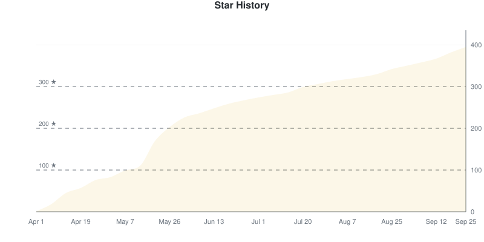
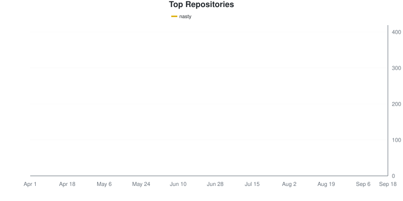
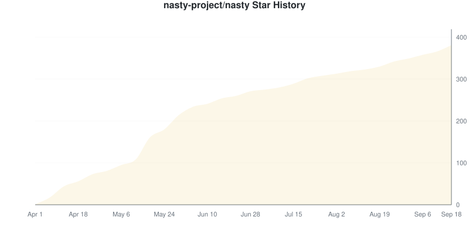
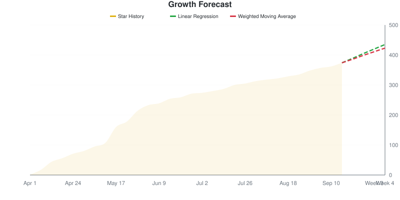

# Star Tracker Report

**2026-08-31** | Total: **350 stars** | Change: **-855**

> Compared to snapshot from 2026-08-31

## 📈 Star Trend

### By Repository

Individual Repository Charts

#### nasty-project/nasty: 350 ★ (0)

## Repositories

| Repositories | Stars | Change | Trend |
|:-----------|------:|-------:|:-----:|
| [nasty-project/nasty](https://github.com/nasty-project/nasty) | 350 | 0 | ➖ |

## Removed Repositories

fenio/anylinuxfs-gui: was 190 stars
fenio/bcachefs-wiki: was 0 stars
fenio/dlna-proxy: was 8 stars
fenio/dotfiles: was 0 stars
fenio/dumb-provisioner: was 12 stars
fenio/fenio.github.io: was 1 stars
fenio/furman: was 15 stars
fenio/gh-rmrf: was 2 stars
fenio/ha-addons: was 17 stars
fenio/homebrew-tap: was 0 stars
fenio/homelab: was 35 stars
fenio/k3s-synology: was 37 stars
fenio/k8s-truenas: was 109 stars
fenio/kerneloops: was 0 stars
fenio/modern-fs-benchmark: was 30 stars
fenio/mongodb-no-avx: was 9 stars
fenio/netalchemy: was 0 stars
fenio/omada-controller-no-avx: was 2 stars
fenio/pv-mounter: was 149 stars
fenio/scoop-bucket: was 0 stars
fenio/setup-k0s: was 1 stars
fenio/setup-k3s: was 2 stars
fenio/setup-krew: was 0 stars
fenio/setup-kubesolo: was 7 stars
fenio/setup-microk8s: was 1 stars
fenio/setup-minikube: was 1 stars
fenio/setup-talos: was 0 stars
fenio/skadis: was 0 stars
fenio/terrarium: was 7 stars
fenio/tns-csi: was 122 stars
fenio/ugly-nas: was 64 stars
fenio/wharf: was 1 stars
fenio/zod: was 7 stars
nasty-project/.github: was 0 stars
nasty-project/nasty-chart: was 1 stars
nasty-project/nasty-csi: was 2 stars
nasty-project/nasty-docs: was 0 stars
nasty-project/nasty-go: was 1 stars
nasty-project/nasty-plugin: was 1 stars
nasty-project/nasty-telemetry: was 0 stars
nasty-project/nasty-tests: was 0 stars
nasty-project/nasty-top: was 21 stars
tns-project/api_client: was 0 stars
tns-project/apps_validation: was 0 stars
tns-project/audit_rules: was 0 stars
tns-project/avahi: was 0 stars
tns-project/binaries: was 0 stars
tns-project/freeipa: was 0 stars
tns-project/grub2: was 0 stars
tns-project/ixdiagnose: was 0 stars
tns-project/ixhardware: was 0 stars
tns-project/licenselib: was 0 stars
tns-project/linux: was 0 stars
tns-project/midcli: was 0 stars
tns-project/middleware: was 0 stars
tns-project/nfs-utils: was 0 stars
tns-project/nfs4xdr-acl-tools: was 0 stars
tns-project/openssl-fips: was 0 stars
tns-project/pam_truenas: was 0 stars
tns-project/parted: was 0 stars
tns-project/py-cryptit: was 0 stars
tns-project/py-fenced: was 0 stars
tns-project/py-libzfs: was 0 stars
tns-project/py-nvme: was 0 stars
tns-project/py-sg3: was 0 stars
tns-project/py-sgio: was 0 stars
tns-project/python-netsnmpagent: was 0 stars
tns-project/python-truenas-requirements: was 0 stars
tns-project/rclone: was 0 stars
tns-project/samba: was 0 stars
tns-project/scale-build: was 0 stars
tns-project/scst: was 0 stars
tns-project/sedutil: was 0 stars
tns-project/smartmontools: was 0 stars
tns-project/sssd: was 0 stars
tns-project/truenas-installer: was 0 stars
tns-project/truenas_connect_utils: was 0 stars
tns-project/truenas_crypto_utils: was 0 stars
tns-project/truenas_pwenc: was 0 stars
tns-project/truenas_pykeyring: was 0 stars
tns-project/truenas_pylibvirt: was 0 stars
tns-project/truenas_pylibzfs: was 0 stars
tns-project/truenas_pynetif: was 0 stars
tns-project/truenas_pyos: was 0 stars
tns-project/truenas_pypam: was 0 stars
tns-project/truenas_pyscstadmin: was 0 stars
tns-project/truenas_scram: was 0 stars
tns-project/truenas_spdk: was 0 stars
tns-project/truenas_verify: was 0 stars
tns-project/webui: was 0 stars
tns-project/zectl: was 0 stars
tns-project/zettarepl: was 0 stars
tns-project/zfs: was 0 stars

## Summary

- **Stars gained:** 0
- **Stars lost:** 855
- **Net change:** -855

## 🔮 Growth Forecast

**Aggregate Forecast**

| Method | Week 1 | Week 2 | Week 3 | Week 4 |
|:---|---:|---:|---:|---:|
| Linear Regression | 366 | 382 | 399 | 415 |
| Weighted Moving Average | 363 | 375 | 388 | 401 |

### By Repository

nasty-project/nasty

**nasty-project/nasty**

| Method | Week 1 | Week 2 | Week 3 | Week 4 |
|:---|---:|---:|---:|---:|
| Linear Regression | 366 | 382 | 399 | 415 |
| Weighted Moving Average | 363 | 375 | 388 | 401 |

---
*Generated by [GitHub Star Tracker](https://github.com/fbuireu/github-star-tracker) on 2026-08-31T17:41:11.088Z*

*Made with 🤘 by [Ferran Buireu](https://github.com/fbuireu)*

