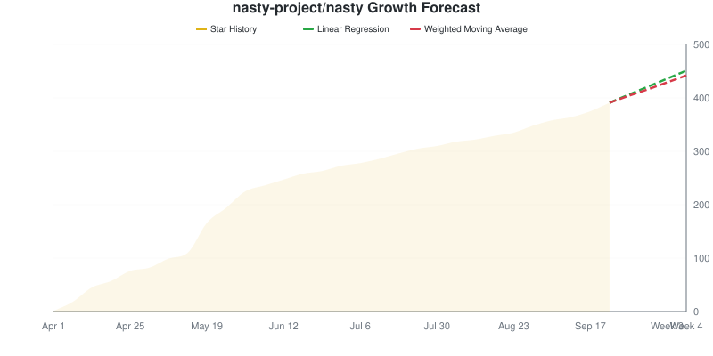

# Star Tracker Report

**2026-09-24** | Total: **393 stars** | Change: **+2**

> Compared to snapshot from 2026-09-23

## 📈 Star Trend

### By Repository

Individual Repository Charts

#### nasty-project/nasty: 393 ★ (+2)

## Repositories

| Repositories | Stars | Change | Trend |
|:-----------|------:|-------:|:-----:|
| [nasty-project/nasty](https://github.com/nasty-project/nasty) | 393 | +2 | ⬆️ |

## Summary

- **Stars gained:** 2
- **Stars lost:** 0
- **Net change:** +2

## 🔮 Growth Forecast

**Aggregate Forecast**

| Method | Week 1 | Week 2 | Week 3 | Week 4 |
|:---|---:|---:|---:|---:|
| Linear Regression | 408 | 423 | 438 | 453 |
| Weighted Moving Average | 406 | 418 | 431 | 444 |

### By Repository

nasty-project/nasty

**nasty-project/nasty**

| Method | Week 1 | Week 2 | Week 3 | Week 4 |
|:---|---:|---:|---:|---:|
| Linear Regression | 408 | 423 | 438 | 453 |
| Weighted Moving Average | 406 | 418 | 431 | 444 |

---
*Generated by [GitHub Star Tracker](https://github.com/fbuireu/github-star-tracker) on 2026-09-24T02:56:36.343Z*

*Made with 🤘 by [Ferran Buireu](https://github.com/fbuireu)*

