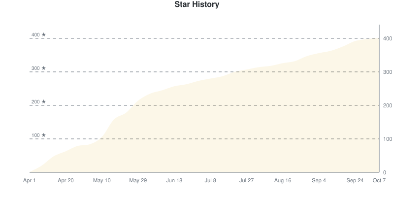
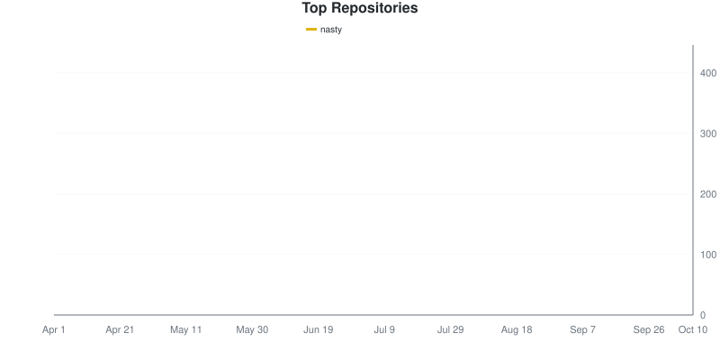
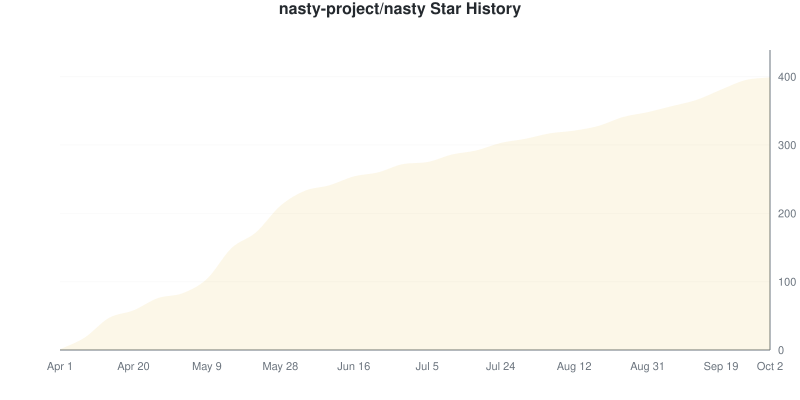
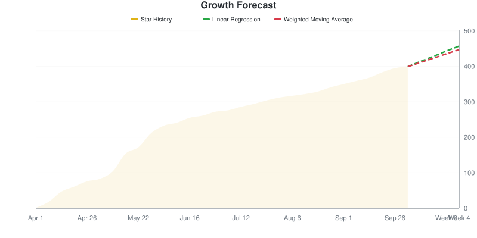
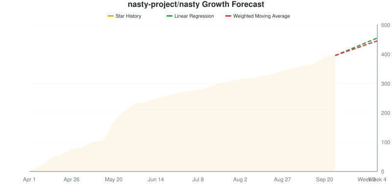

# Star Tracker Report

**2026-09-29** | Total: **396 stars** | Change: **0**

> Compared to snapshot from 2026-09-28

## 📈 Star Trend

### By Repository

Individual Repository Charts

#### nasty-project/nasty: 396 ★ (0)

## Repositories

| Repositories | Stars | Change | Trend |
|:-----------|------:|-------:|:-----:|
| [nasty-project/nasty](https://github.com/nasty-project/nasty) | 396 | 0 | ➖ |

## 🔮 Growth Forecast

**Aggregate Forecast**

| Method | Week 1 | Week 2 | Week 3 | Week 4 |
|:---|---:|---:|---:|---:|
| Linear Regression | 411 | 426 | 440 | 455 |
| Weighted Moving Average | 408 | 421 | 433 | 445 |

### By Repository

nasty-project/nasty

**nasty-project/nasty**

| Method | Week 1 | Week 2 | Week 3 | Week 4 |
|:---|---:|---:|---:|---:|
| Linear Regression | 411 | 426 | 440 | 455 |
| Weighted Moving Average | 408 | 421 | 433 | 445 |

---
*Generated by [GitHub Star Tracker](https://github.com/fbuireu/github-star-tracker) on 2026-09-29T03:59:07.988Z*

*Made with 🤘 by [Ferran Buireu](https://github.com/fbuireu)*

