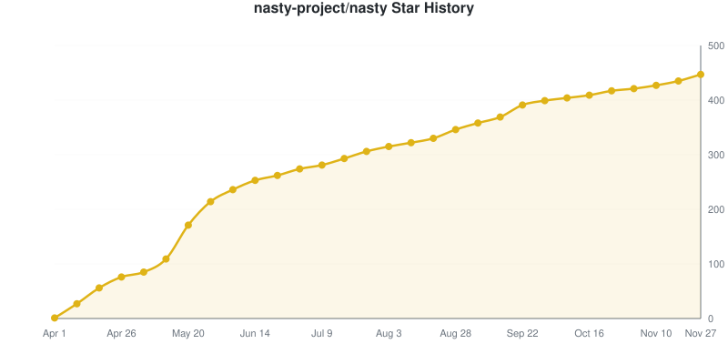
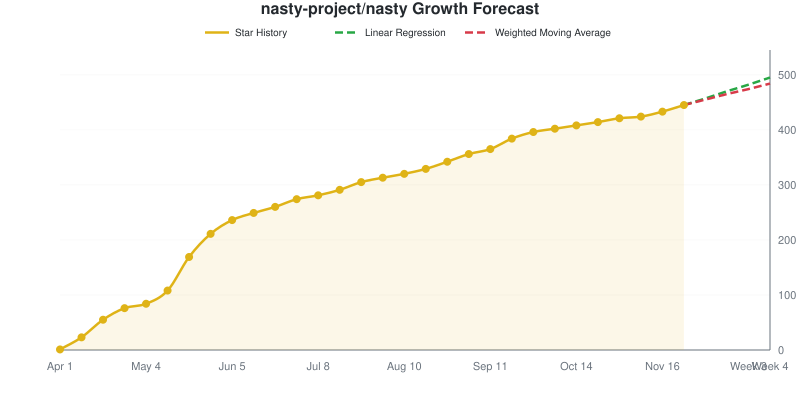

# Star Tracker Report

**2026-11-18** | Total: **434 stars** | Change: **+1**

> Compared to snapshot from 2026-11-17

## 📈 Star Trend

### By Repository

Individual Repository Charts

#### nasty-project/nasty: 434 ★ (+1)

## Repositories

| Repositories | Stars | Change | Trend |
|:-----------|------:|-------:|:-----:|
| [nasty-project/nasty](https://github.com/nasty-project/nasty) | 434 | +1 | ⬆️ |

## Summary

- **Stars gained:** 1
- **Stars lost:** 0
- **Net change:** +1

## 🔮 Growth Forecast

**Aggregate Forecast**

| Method | Week 1 | Week 2 | Week 3 | Week 4 |
|:---|---:|---:|---:|---:|
| Linear Regression | 447 | 459 | 472 | 484 |
| Weighted Moving Average | 444 | 453 | 463 | 473 |

### By Repository

nasty-project/nasty

**nasty-project/nasty**

| Method | Week 1 | Week 2 | Week 3 | Week 4 |
|:---|---:|---:|---:|---:|
| Linear Regression | 447 | 459 | 472 | 484 |
| Weighted Moving Average | 444 | 453 | 463 | 473 |

---
*Generated by [GitHub Star Tracker](https://github.com/fbuireu/github-star-tracker) on 2026-11-18T05:44:50.519Z*

*Made with 🤘 by [Ferran Buireu](https://github.com/fbuireu)*

